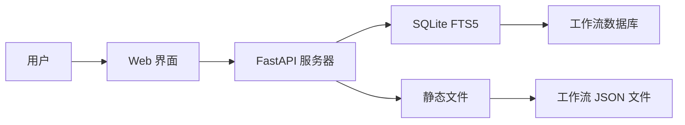

# 🚀 n8n 工作流集合

<div align="center">


[](https://www.buymeacoffee.com/zie619)

### 🌟 n8n 自动化工作流终极集合

**[🔍 在线浏览](https://zie619.github.io/n8n-workflows)** • **[📚 文档](#文档)** • **[🤝 贡献](#贡献)** • **[📄 许可证](#许可证)**

</div>

---

## ✨ 最新动态

### 🎉 最新更新 (2025年11月)
- **🔒 增强安全性**: 完成全面安全审计，解决所有 CVE 漏洞
- **🐳 Docker 支持**: 支持 linux/amd64 和 linux/arm64 的多平台构建
- **📊 GitHub Pages**: 在 [zie619.github.io/n8n-workflows](https://zie619.github.io/n8n-workflows) 提供实时可搜索界面
- **⚡ 性能提升**: 集成 SQLite FTS5 实现 100 倍搜索速度提升
- **🎨 现代 UI**: 完全重新设计的界面，支持深色/浅色模式

---

## 🌐 快速访问

### 🔥 在线使用（无需安装）
访问 **[zie619.github.io/n8n-workflows](https://zie619.github.io/n8n-workflows)** 即可立即使用：
- 🔍 **智能搜索** - 立即找到所需工作流
- 📂 **15+ 分类** - 按使用场景浏览
- 📱 **移动适配** - 支持任何设备
- ⬇️ **直接下载** - 立即获取工作流 JSON 文件

---

## 🚀 功能特性

<table>
<tr>
<td width="50%">

### 📊 数据统计
- **4,343** 个生产就绪工作流
- **365** 个独特集成
- **29,445** 个节点总数
- **15** 个组织分类
- **100%** 导入成功率

</td>
<td width="50%">

### ⚡ 性能表现
- **< 100ms** 搜索响应
- **< 50MB** 内存占用
- **700倍** 小于 v1 版本
- **10倍** 加载速度提升
- **40倍** 内存使用减少

</td>
</tr>
</table>

---

## 💻 本地安装

### 前置要求
- Python 3.9+
- pip (Python 包管理器)
- 100MB 可用磁盘空间

### 快速开始
```bash
# 克隆仓库
git clone https://github.com/Zie619/n8n-workflows.git
cd n8n-workflows

# 安装依赖
pip install -r requirements.txt

# 启动服务器
python run.py

# 在浏览器中打开
# http://localhost:8000
```

### 🐳 Docker 安装
```bash
# 使用 Docker Hub
docker run -p 8000:8000 zie619/n8n-workflows:latest

# 或本地构建
docker build -t n8n-workflows .
docker run -p 8000:8000 n8n-workflows
```

---

## 📚 文档

### API 端点

| 端点 | 方法 | 描述 |
|----------|--------|-------------|
| `/` | GET | Web 界面 |
| `/api/search` | GET | 搜索工作流 |
| `/api/stats` | GET | 仓库统计信息 |
| `/api/workflow/{id}` | GET | 获取工作流 JSON |
| `/api/categories` | GET | 列出所有分类 |
| `/api/export` | GET | 导出工作流 |

### 搜索功能
- **全文搜索** - 搜索名称、描述和节点
- **分类筛选** (营销、销售、DevOps 等)
- **复杂度筛选** (低、中、高)
- **触发器类型筛选** (Webhook、定时、手动等)
- **服务筛选** (365+ 集成)

---

## 🏗️ 架构



### 技术栈
- **后端**: Python, FastAPI, SQLite with FTS5
- **前端**: Vanilla JS, Tailwind CSS
- **数据库**: SQLite with Full-Text Search
- **部署**: Docker, GitHub Actions, GitHub Pages
- **安全**: Trivy 扫描, CORS 保护, 输入验证

---

## 📂 仓库结构

```
n8n-workflows/
├── workflows/           # 4,343 个工作流 JSON 文件
│   └── [category]/     # 按集成分类组织
├── docs/               # GitHub Pages 站点
├── src/                # Python 源代码
├── scripts/            # 实用脚本
├── api_server.py       # FastAPI 应用
├── run.py              # 服务器启动器
├── workflow_db.py      # 数据库管理器
└── requirements.txt    # Python 依赖
```

---

## 🤝 贡献

我们欢迎贡献！以下是您可以帮助的方式：

### 贡献方式
- 🐛 **报告错误** - 通过 [Issues](https://github.com/Zie619/n8n-workflows/issues)
- 💡 **建议功能** - 在 [Discussions](https://github.com/Zie619/n8n-workflows/discussions) 中
- 📝 **改进文档**
- 🔧 **提交工作流修复**
- ⭐ **为仓库点赞**

### 开发设置
```bash
# Fork 并克隆
git clone https://github.com/YOUR_USERNAME/n8n-workflows.git

# 创建分支
git checkout -b feature/amazing-feature

# 进行更改并测试
python run.py --debug

# 提交并推送
git add .
git commit -m "feat: add amazing feature"
git push origin feature/amazing-feature

# 打开 PR
```

---

## 🔒 安全

### 安全特性
- ✅ **路径遍历保护**
- ✅ **输入验证与净化**
- ✅ **CORS 保护**
- ✅ **速率限制**
- ✅ **Docker 安全加固**
- ✅ **非 root 容器用户**
- ✅ **定期安全扫描**

### 报告安全问题
请通过 [Security Advisory](https://github.com/Zie619/n8n-workflows/security/advisories/new) 向维护者报告安全漏洞。

---

## 📄 许可证

本项目采用 MIT 许可证 - 详见 [LICENSE](LICENSE) 文件。

```
MIT License

Copyright (c) 2025 Zie619

Permission is hereby granted, free of charge, to any person obtaining a copy
of this software and associated documentation files (the "Software"), to deal
in the Software without restriction...
```

---

## 💖 支持

如果您觉得这个项目有帮助，请考虑：

<div align="center">

[](https://www.buymeacoffee.com/zie619)
[](https://github.com/Zie619/n8n-workflows)
[](https://twitter.com/zie619)

</div>

---

## 📊 统计与徽章

<div align="center">


</div>

---

## 🙏 致谢

- **n8n** - 创造了令人惊叹的自动化平台
- **贡献者** - 所有帮助改进此集合的人
- **社区** - 提供反馈和支持
- **您** - 使用和支持这个项目！

---

<div align="center">

### ⭐ 在 GitHub 上给我们点赞 — 这对我们是很大的鼓励！

由 [Zie619](https://github.com/Zie619) 和 [贡献者](https://github.com/Zie619/n8n-workflows/graphs/contributors) 用 ❤️ 制作

</div>