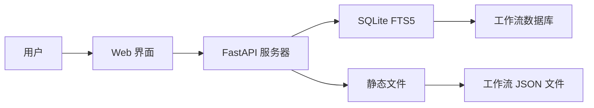

# 🚀 n8n 工作流集合

## 💻 本地安装

### 前置要求
- Python 3.9+
- pip (Python 包管理器)
- 100MB 可用磁盘空间

### 快速开始
```bash
# 克隆仓库
git clone https://github.com/purpose168/n8n-workflows.git
cd n8n-workflows

# 安装依赖
pip install -r requirements.txt

# 启动服务器
python run.py

# 在浏览器中打开
# http://localhost:8000
```

---

## 📚 文档

### API 端点

| 端点 | 方法 | 描述 |
|----------|--------|-------------|
| `/` | GET | Web 界面 |
| `/api/search` | GET | 搜索工作流 |
| `/api/stats` | GET | 仓库统计信息 |
| `/api/workflow/{id}` | GET | 获取工作流 JSON |
| `/api/categories` | GET | 列出所有分类 |
| `/api/export` | GET | 导出工作流 |

### 搜索功能
- **全文搜索** - 搜索名称、描述和节点
- **分类筛选** (营销、销售、DevOps 等)
- **复杂度筛选** (低、中、高)
- **触发器类型筛选** (Webhook、定时、手动等)
- **服务筛选** (365+ 集成)

---

## 🏗️ 架构



### 技术栈
- **后端**: Python, FastAPI, SQLite with FTS5
- **前端**: Vanilla JS, Tailwind CSS
- **数据库**: SQLite with Full-Text Search
- **部署**: Docker, GitHub Actions, GitHub Pages
- **安全**: Trivy 扫描, CORS 保护, 输入验证

---

## 📂 仓库结构

```
n8n-workflows/
├── workflows/           # 4,343 个工作流 JSON 文件
│   └── [category]/     # 按集成分类组织
├── docs/               # GitHub Pages 站点
├── src/                # Python 源代码
├── scripts/            # 实用脚本
├── api_server.py       # FastAPI 应用
├── run.py              # 服务器启动器
├── workflow_db.py      # 数据库管理器
└── requirements.txt    # Python 依赖
```

---

## 🤝 贡献

我们欢迎贡献！以下是您可以帮助的方式：

### 贡献方式
- 🐛 **报告错误** - 通过 [Issues](https://github.com/Zie619/n8n-workflows/issues)
- 💡 **建议功能** - 在 [Discussions](https://github.com/Zie619/n8n-workflows/discussions) 中
- 📝 **改进文档**
- 🔧 **提交工作流修复**
- ⭐ **为仓库点赞**

### 开发设置
```bash
# Fork 并克隆
git clone https://github.com/YOUR_USERNAME/n8n-workflows.git

# 创建分支
git checkout -b feature/amazing-feature

# 进行更改并测试
python run.py --debug

# 提交并推送
git add .
git commit -m "feat: add amazing feature"
git push origin feature/amazing-feature

# 打开 PR
```

---

## 🔒 安全

### 安全特性
- ✅ **路径遍历保护**
- ✅ **输入验证与净化**
- ✅ **CORS 保护**
- ✅ **速率限制**
- ✅ **Docker 安全加固**
- ✅ **非 root 容器用户**
- ✅ **定期安全扫描**
